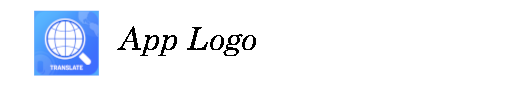
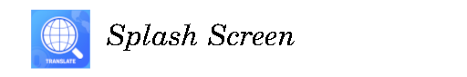
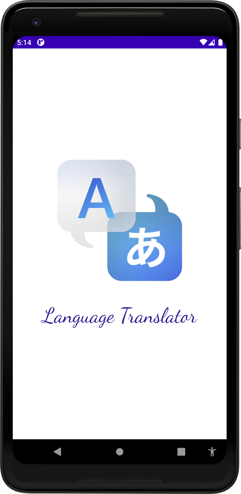
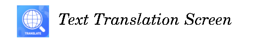
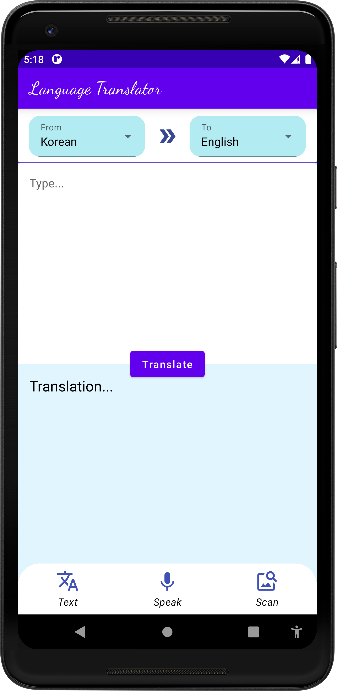
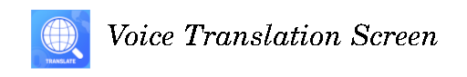
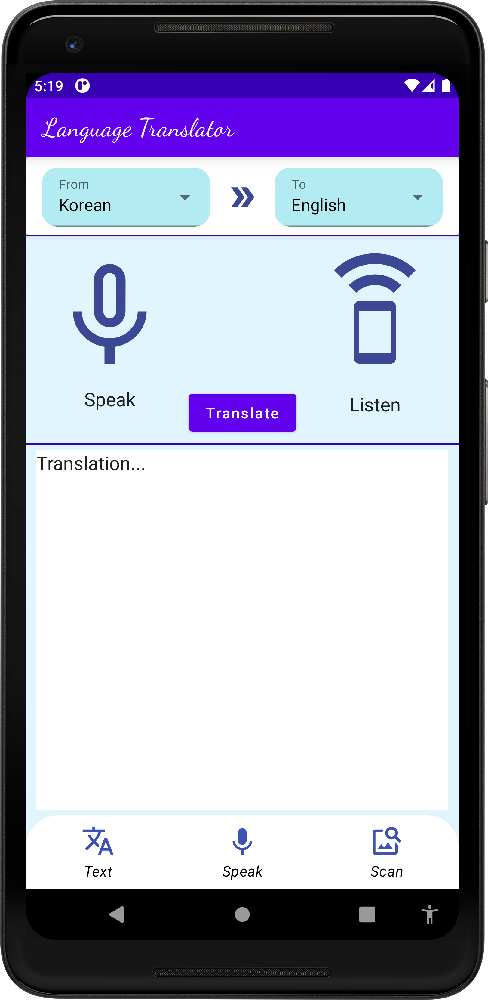
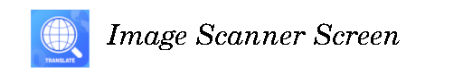
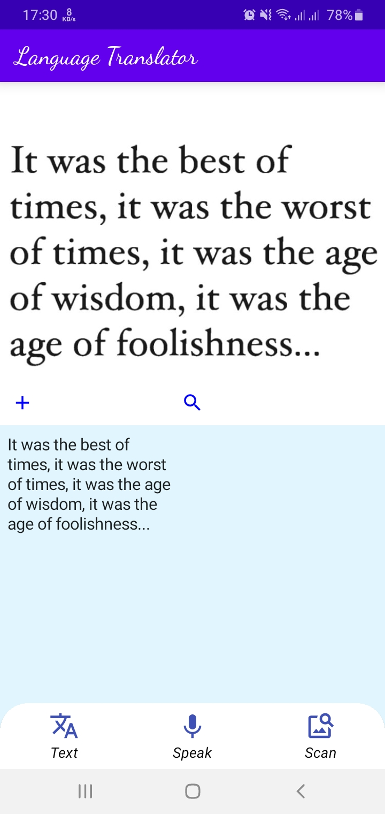

# Android Language Translator App Using Jetpack Compose and MLKit

This repository contains an Android Studio project to help people translate a language.
The project is built using Jetpack Compose and MLKit in Android.

For more information about Jetpack Compose and MLKit, you can read [Jetpack Compose](https://developer.android.com/jetpack/compose) and [MLKit](https://developers.google.com/ml-kit)

------------

| Language Translator App                                                                                                                                                                                                                                                                                                                                                                                                                            | |
|:---------------------------------------------------------------------------------------------------------------------------------------------------------------------------------------------------------------------------------------------------------------------------------------------------------------------------------------------------------------------------------------------------------------------------------------------------|---------|
| </img> <br><br><br>This is the logo of this Android App that will be displayed on Play Store.<br><br><br>• Beautiful App Logo <br><br>                                                                                                                                                                                                                                                        |  |
|                                                                                                                                                                                                                                                                                                                                                                                                                                                    |  |
| <br></img> <br><br><br>Splash Screen appears when the app is launched for a few seconds.<br><br><br>• Splash Screen Logo<br>• App Name<br>• Animated as Twin animation<br><br>                                                                                                                                                                                                         | |
|                                                                                                                                                                                                                                                                                                                                                                                                                                                    |  |
| <br></img> <br><br><br>This is the Text Translation Screen where a user can choose source and target language. The user then can translate the input text.<br><br><br>• User friendly UI<br>• `EditText` is placed to enter an input text<br>• `TextView` is used to display the translated text<br>• Translated text can be copied<br><br>                                           |  |
|                                                                                                                                                                                                                                                                                                                                                                                                                                                    |  |
| <br></img> <br><br><br>This is the Voice Translation Screen where a user can choose source and target language. Afterwards, the user can speak to the microphone.<br>• Speak to the app to translate your voice<br>• Converts voice to text and displays the input text<br><br><br>• Translate the speech at one click<br>• Listen the translation by pressing speaker icon<br><br> | |
|                                                                                                                                                                                                                                                                                                                                                                                                                                                    |  |
| <br></img> <br><br><br>This is the Image Scanner Screen where a user can upload an image to extract its text. The scanned text can be copied and could be pasted as an input text on Text Translation Screen to translate<br><br><br>• Simple file upload<br>• Dynamic text recognition<br>• Copiable text as output<br><br>                                                            | |

------------

## License
```
Copyright 2023 The Android Open Source Project

Licensed under the Apache License, Version 2.0 (the "License");
you may not use this file except in compliance with the License.
You may obtain a copy of the License at

    https://www.apache.org/licenses/LICENSE-2.0

Unless required by applicable law or agreed to in writing, software
distributed under the License is distributed on an "AS IS" BASIS,
WITHOUT WARRANTIES OR CONDITIONS OF ANY KIND, either express or implied.
See the License for the specific language governing permissions and
limitations under the License.
```